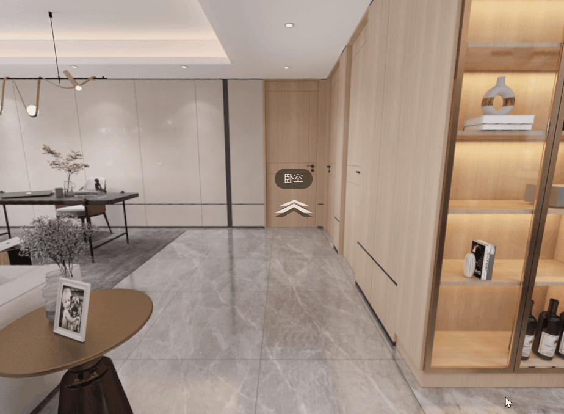
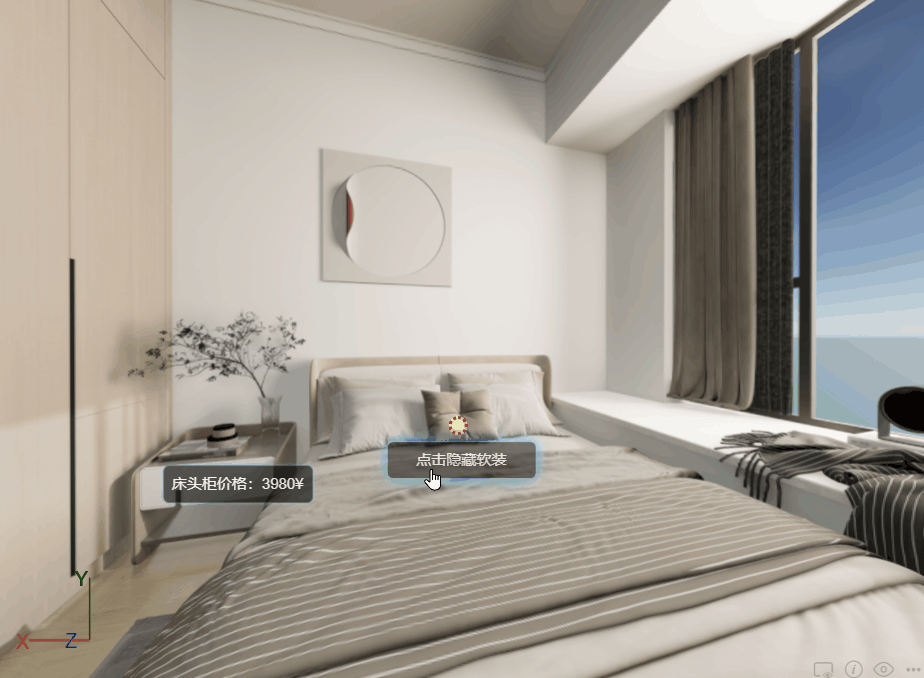

# pano-viewer
pano-viewer is a WebGL based JS SDK, it is built on top of three.js. It is used to view panoramas. It supports viewing a panorama with 1 image, 6 images, or 24 images; It supports viewing a serials of panoramas; It supports hotpoints;


## Examples
``` typescript
import { PanoViewer, PanoViewerConfig } from "./dist/pano-viewer.esm.js";

const viewerCfg: PanoViewerConfig = {
    containerId: "myCanvas",
};
const viewpoints = [{
    panoramas: [{
        id: "panorama_1",
        images: "/images/pano_1.jpg",
    }],
    id: "viewpoint_1",
    name: "Living room",
    position: [0, 1, 0],
    initialDirection: [1, 0, 0],
}, {
    panoramas: [{
        id: "panorama_2",
        images: "/images/pano_1.jpg",
    }],
    id: "viewpoint_2",
    name: "Bedroom",
    position: [5, 1, 0],
    initialDirection: [-1, 0, 0],
}];
const viewer = new PanoViewer(viewerCfg);
viewer.setViewpoints(viewpoints);
viewer.activatePanoramaById(viewpoints[0].id, viewpoints[0].panoramas[0].id);
console.log("Loaded");
```

## Project setup
```
npm install
```

### Compiles and hot-reloads for development
```
npm start
```

### Compiles and minifies for production
```
npm run build
```

### Lints and fixes files
```
npm run lint
```

### Documentation
```
npm run docs
```
Documents will be generated into "./docs" folder.

## Features
- Load and view a panorama

- Switch to another panorama

- Switch between decorations

`End`
