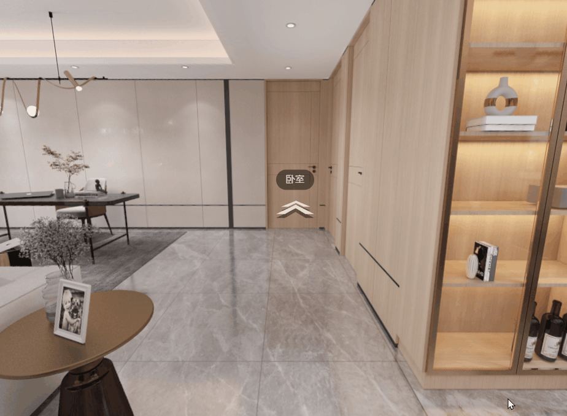
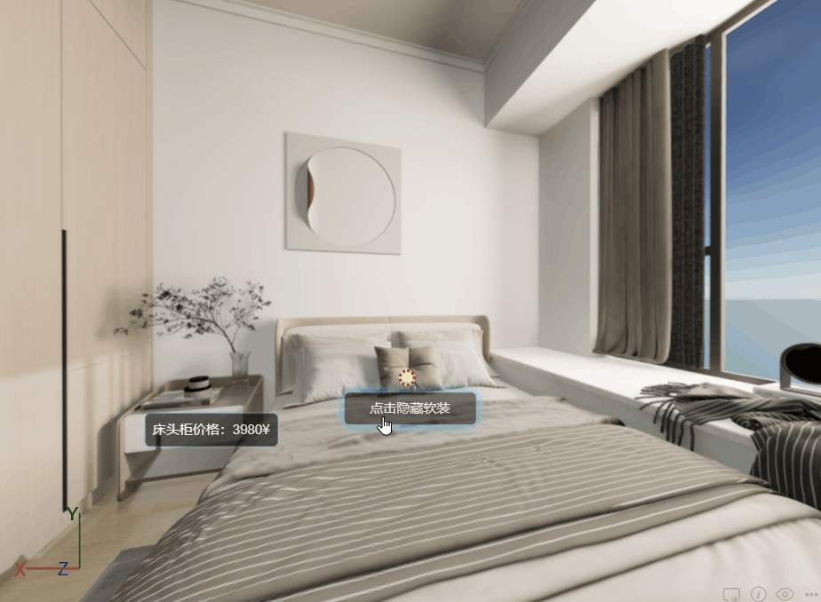

# pano-viewer

<p align="center">
  <b>A WebGL-based panorama viewer SDK built on three.js</b><br/>
  Load, navigate, and hotspot-link 360° panoramas with a single lightweight library.
</p>

<p align="center">
  <a href="https://www.npmjs.com/package/pano-viewer"></a>
  <a href="https://www.npmjs.com/package/pano-viewer"></a>
  <a href="https://github.com/yourusername/pano-viewer/blob/main/LICENSE"></a>
  
  
  
</p>

---

## What is pano-viewer?

**pano-viewer** is a zero-dependency\* JavaScript/TypeScript SDK for rendering interactive 360° panoramas in the browser using WebGL (via [three.js](https://threejs.org/)).

It is designed for **real-estate tours**, **virtual walkthroughs**, **museum exhibits**, and any experience that needs seamless panorama navigation.

> \* Runtime peer dependency: `three.js`

---

## Key Features

| Feature | Description |
|---|---|
| **Multiple image formats** | Single equirectangular image, 6-image cubemap, or 24-tile high-res cubemap |
| **Multi-viewpoint tours** | Link panoramas into a navigable tour with hotpoints |
| **Hotpoints** | Place interactive markers in 3D space to jump between viewpoints |
| **Decorations** | Overlay custom 3D objects or UI elements on the scene |
| **TypeScript-first** | Full type definitions included (`dist/types`) |
| **Tree-shakeable ESM** | Ships as a pure ES module for minimal bundle impact |
| **Framework-agnostic** | Works with React, Vue, Angular, Svelte, or plain HTML |

---

## Demo

| Load & view a panorama | Switch panoramas | Switch decorations |
|---|---|---|
|  |  |  |

---

## Installation

```bash
npm install pano-viewer
# or
yarn add pano-viewer
# or
pnpm add pano-viewer
```

> **Note:** `three.js` is a peer dependency. If it is not already in your project, install it too:
> ```bash
> npm install three
> ```

---

## Quick Start

```typescript
import { PanoViewer, PanoViewerConfig } from "pano-viewer";

// 1. Create the viewer bound to a container element
const config: PanoViewerConfig = {
    containerId: "myCanvas",
};
const viewer = new PanoViewer(config);

// 2. Define viewpoints (locations in the virtual space)
const viewpoints = [
    {
        id: "vp_living_room",
        name: "Living Room",
        position: [0, 1, 0],
        initialDirection: [1, 0, 0],
        panoramas: [
            {
                id: "pano_living_room",
                images: "/images/living_room_360.jpg", // equirectangular image
            },
        ],
    },
    {
        id: "vp_bedroom",
        name: "Bedroom",
        position: [5, 1, 0],
        initialDirection: [-1, 0, 0],
        panoramas: [
            {
                id: "pano_bedroom",
                images: "/images/bedroom_360.jpg",
            },
        ],
    },
];

// 3. Load and activate
viewer.setViewpoints(viewpoints);
viewer.activatePanoramaById("vp_living_room", "pano_living_room");
```

---

## Image Format Reference

### Single equirectangular image (simplest)

```typescript
panoramas: [{
    id: "pano_1",
    images: "/images/equirectangular.jpg",
}]
```

### 6-image cubemap

```typescript
panoramas: [{
    id: "pano_cubemap",
    images: {
        px: "/images/cube/px.jpg",  // +X face
        nx: "/images/cube/nx.jpg",  // -X face
        py: "/images/cube/py.jpg",  // +Y face
        ny: "/images/cube/ny.jpg",  // -Y face
        pz: "/images/cube/pz.jpg",  // +Z face
        nz: "/images/cube/nz.jpg",  // -Z face
    },
}]
```

### 24-tile high-resolution cubemap

Pass an array of 24 tile paths for maximum detail in large-screen or VR scenarios.

---

## API Overview

### `new PanoViewer(config: PanoViewerConfig)`

Creates a new viewer instance.

| Option | Type | Default | Description |
|---|---|---|---|
| `containerId` | `string` | — | ID of the HTML element to render into |
| `fov` | `number` | `75` | Initial field of view (degrees) |
| `autoRotate` | `boolean` | `false` | Enable automatic scene rotation |

### `viewer.setViewpoints(viewpoints: Viewpoint[])`

Loads the full list of viewpoints (locations) into the scene graph.

### `viewer.activatePanoramaById(viewpointId, panoramaId)`

Transitions to the specified panorama. Triggers a loading animation if the image is not yet cached.

### `viewer.addHotpoint(hotpoint: Hotpoint)`

Places an interactive hotpoint marker in 3D space.

### `viewer.destroy()`

Disposes all GPU resources and removes event listeners. Always call this when unmounting.

> Full API documentation can be generated locally:
> ```bash
> npm run docs
> ```
> Output is written to the `./docs` folder.

---

## Framework Integration Examples

<details>
<summary><b>React</b></summary>

```tsx
import { useEffect, useRef } from "react";
import { PanoViewer } from "pano-viewer";

export function PanoViewerComponent({ viewpoints }) {
    const containerRef = useRef<HTMLDivElement>(null);

    useEffect(() => {
        if (!containerRef.current) return;
        const viewer = new PanoViewer({ containerId: containerRef.current.id });
        viewer.setViewpoints(viewpoints);
        viewer.activatePanoramaById(viewpoints[0].id, viewpoints[0].panoramas[0].id);
        return () => viewer.destroy();
    }, []);

    return <div id="pano-container" ref={containerRef} style={{ width: "100%", height: "500px" }} />;
}
```
</details>

<details>
<summary><b>Vue 3</b></summary>

```vue
<template>
  <div id="pano-container" ref="container" style="width:100%;height:500px" />
</template>

<script setup lang="ts">
import { onMounted, onUnmounted } from "vue";
import { PanoViewer } from "pano-viewer";

let viewer: PanoViewer;
onMounted(() => {
    viewer = new PanoViewer({ containerId: "pano-container" });
    viewer.setViewpoints(props.viewpoints);
    viewer.activatePanoramaById(props.viewpoints[0].id, props.viewpoints[0].panoramas[0].id);
});
onUnmounted(() => viewer?.destroy());
</script>
```
</details>

---

## Comparison with Alternatives

| | **pano-viewer** | Pannellum | Photo Sphere Viewer | Marzipano |
|---|---|---|---|---|
| Three.js-based | ✅ | ❌ | ❌ | ❌ |
| TypeScript-first | ✅ | ❌ | ✅ | ❌ |
| Multi-viewpoint tours | ✅ | ✅ | ✅ | ✅ |
| 24-tile cubemap | ✅ | ❌ | ❌ | ✅ |
| ESM tree-shakeable | ✅ | ❌ | ✅ | ❌ |
| Custom 3D decorations | ✅ | ❌ | ❌ | ❌ |

---

## Project Setup

```bash
# Install dependencies
npm install

# Development server with hot-reload (http://localhost:9000)
npm start

# Production build
npm run build

# Lint & auto-fix
npm run lint

# Generate API docs
npm run docs
```

---

## Contributing

Contributions are welcome! Please read [CONTRIBUTING.md](CONTRIBUTING.md) for guidelines.

1. Fork the repository
2. Create a feature branch: `git checkout -b feat/my-feature`
3. Commit your changes following [Conventional Commits](https://www.conventionalcommits.org/)
4. Open a Pull Request

---

## Changelog

See [CHANGELOG.md](CHANGELOG.md) for version history.

---

## License

[MIT](LICENSE) © pano-viewer contributors
